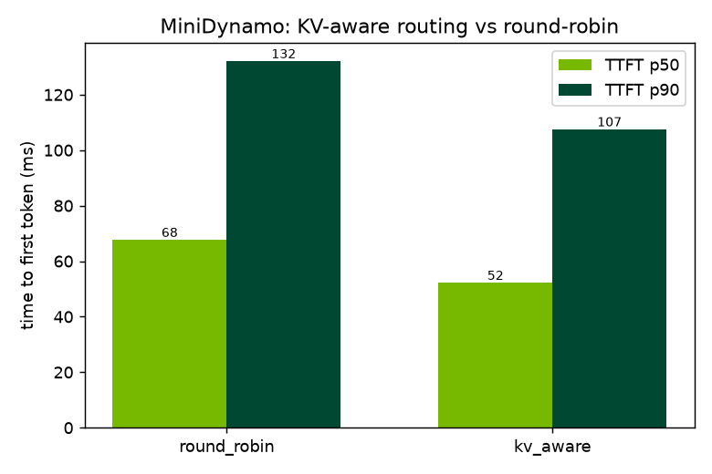

# MiniDynamo

A scaled-down, self-hostable reimplementation of the core ideas in
[**NVIDIA Dynamo**](https://github.com/ai-dynamo/dynamo) — a distributed LLM
inference **router** that routes each request to the worker that can serve it
fastest, primarily by reusing the **KV cache** those workers already hold.

- **Rust** async frontend (`axum`) exposing an **OpenAI-compatible** API
- **Python** model workers (`FastAPI`) behind a pluggable backend
- A **KV-cache-aware smart router** (radix tree of token-block hashes → workers)
- **Disaggregated serving**: separate prefill / decode worker roles
- A **benchmark** showing KV-aware routing beats round-robin on TTFT & cache hits
- Runs on **CPU** — no NVIDIA GPU required

> Why it exists: I wanted to understand how modern inference-serving systems
> actually work, so I rebuilt a faithful slice of one. See
> [`docs/ARCHITECTURE.md`](docs/ARCHITECTURE.md) for the design and how each
> piece maps to real Dynamo.

**The layer below:** [nano-infer](https://github.com/NathanS7878/nano-infer) is what a worker actually does on the GPU — a from-scratch single-GPU
inference engine with custom CUDA kernels, a paged KV cache and INT8/INT4
quantization. MiniDynamo decides *which* worker runs a request; nano-infer is
that worker.

## Quickstart

Prereqs: Rust (`rustup`), Python 3.11+.

```bash
# 1. Python workers
python -m venv .venv
.venv/Scripts/pip install -r workers/requirements.txt   # (bin/pip on macOS/Linux)

# 2. Launch 2 workers + the router (builds the Rust router on first run)
python scripts/dev.py --workers 2
```

Then, in another terminal, hit the OpenAI-compatible endpoint:

```bash
curl http://localhost:8000/v1/chat/completions \
  -H "Content-Type: application/json" \
  -d '{"model":"minidynamo","messages":[{"role":"user","content":"hello"}],"stream":true}'
```

Metrics are at `http://localhost:8000/metrics` (Prometheus format).

## Results

On a workload of 24 multi-turn conversations (96 requests, 4 workers) with
shared, growing prefixes — the workload class Dynamo targets — KV-aware routing
beats round-robin on every metric:

| metric | round_robin | kv_aware | improvement |
|---|---|---|---|
| TTFT p50 (ms) | 67.6 | 52.1 | **23% lower** |
| TTFT p90 (ms) | 132.0 | 107.4 | **19% lower** |
| cache hit rate | 0.0% | **91.1%** | +91 pts |
| throughput (rps) | 226.3 | 278.4 | **19% higher** |



Reproduce: `python bench/bench.py --workers 4 --conversations 24 --turns 4`

## Status

Built in phases — see the roadmap below.

- [x] **Phase 1** — Rust OpenAI-compatible frontend, Python workers, round-robin routing, streaming
- [x] **Phase 2** — KV-cache-aware routing (block-hash radix mirror, longest-prefix match, load fallback, fair tie-break)
- [x] **Benchmark** — KV-aware vs round-robin harness with TTFT/cache-hit/throughput + chart
- [ ] **Phase 3** — Real tiny model backend on CPU (llama.cpp)
- [ ] **Phase 4** — Disaggregated prefill / decode
- [ ] **Phase 5** — Docker/Kubernetes deployment
- [ ] **Phase 6** — Docs polish

## Layout

```
router/     Rust router (axum): API, routing policies, KV radix tree, metrics
workers/    Python workers (FastAPI): model backend + local KV cache
bench/      Benchmark harness + request traces
deploy/     Dockerfiles, docker-compose, k8s manifests
docs/       Architecture
scripts/    Local dev launcher
```
